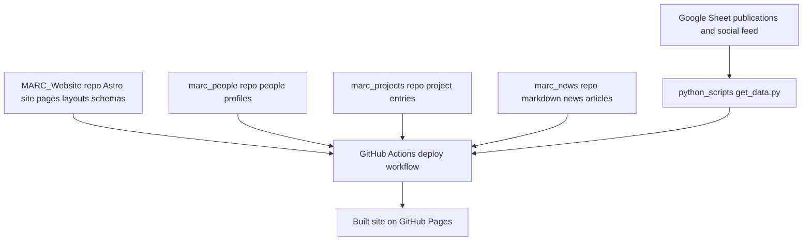

# MARC Website

:wave: This repository contains the main Astro-based website for the Multidisciplinary AI Research Centre (MARC).

At a high level, this repository provides the website application itself: layouts, pages, components, styling, routing, and the content schemas that define what data the site expects.

The actual content is split across separate repositories:
- [`marc_people`](https://github.com/pdnMARC/marc_people)
- [`marc_projects`](https://github.com/pdnMARC/marc_projects)
- [`marc_news`](https://github.com/pdnMARC/marc_news)

In addition, some structured data is pulled from a shared Google Sheet and converted into JSON during the build/update flow.

> [!IMPORTANT]
> A GitHub Personal Access Token (PAT) is used to connect the dependent repositories and trigger automatic website updates when one of those repositories changes.
> The secret name used in the content repositories is `SITE_REPO_TOKEN`, and it is referenced by the trigger workflows such as [`marc_people/.github/workflows/trigger-site.yml`](https://github.com/pdnMARC/marc_people/blob/main/.github/workflows/trigger-site.yml), [`marc_projects/.github/workflows/trigger-site.yml`](https://github.com/pdnMARC/marc_projects/blob/main/.github/workflows/trigger-site.yml), and [`marc_news/.github/workflows/trigger-site.yml`](https://github.com/pdnMARC/marc_news/blob/main/.github/workflows/trigger-site.yml).
> The current PAT has a lifetime of 366 days and should be renewed around **March 11, 2027**.

## :sparkles: Overview

The website is built with:
- `Astro` for the site framework and content collections
- `Tailwind CSS` and `daisyUI` for styling
- `Python` plus `pandas` for syncing spreadsheet-based data
- `GitHub Actions` for deployment

## :gear: How the setup works

The main idea is:
- this repository defines the website code and the content schemas
- [`marc_people`](https://github.com/pdnMARC/marc_people), [`marc_projects`](https://github.com/pdnMARC/marc_projects), and [`marc_news`](https://github.com/pdnMARC/marc_news) hold the Markdown content and images for their respective sections
- a Google Sheet provides publication data and social feed data
- the deployment workflow pulls all of this together, then builds and deploys the site

## :triangular_ruler: High-level architecture



## :card_file_box: External content repositories

### [`marc_people`](https://github.com/pdnMARC/marc_people)
Stores the people profiles used by the website.

These entries are cloned into the website build as the people collection.

### [`marc_projects`](https://github.com/pdnMARC/marc_projects)
Stores the project Markdown files and cover images.

These entries are cloned into the website build as the projects collection.

### [`marc_news`](https://github.com/pdnMARC/marc_news)
Stores the Markdown news articles and cover images.

These entries are cloned into the website build as the news collection.

## :bar_chart: Google Sheet data source

The website also pulls structured data from this Google Sheet:
- `https://docs.google.com/spreadsheets/d/1vhvcqlhc_bTdGScX3iYQ4T9HTD2uLbKD22rsrI_qA8U/edit?usp=sharing`

This sheet is used for:
- publications
- social feed / social news items

During the update/build flow, the Python script [`python_scripts/get_data.py`](https://github.com/pdnMARC/pdnmarc.github.io/blob/main/python_scripts/get_data.py) downloads CSV exports from the relevant sheet tabs and writes:
- `src/collection_publications/publications.json`
- `src/collection_news/social_news.json`

So the website has two kinds of news-related content:
- full Markdown news articles from [`marc_news`](https://github.com/pdnMARC/marc_news)
- shorter social feed items from the Google Sheet

## :rocket: Deployment flow

The deployment workflow lives at [`.github/workflows/deploy.yaml`](https://github.com/pdnMARC/pdnmarc.github.io/blob/main/.github/workflows/deploy.yaml).

At a high level it does the following:
1. Checks out this repository.
2. Removes local debug content collections.
3. Clones `pdnMARC/marc_people` into `src/collection_people`.
4. Clones `pdnMARC/marc_projects` into `src/collection_projects`.
5. Clones `pdnMARC/marc_news` into `src/collection_news`.
6. Installs Python and syncs spreadsheet-based data with `python_scripts/get_data.py`.
7. Builds the Astro site.
8. Deploys to GitHub Pages.

This means the live site is assembled from multiple sources during deployment, rather than storing all content directly in this repository.

## :bookmark_tabs: Content schemas

The content schemas are defined in [`src/content.config.ts`](https://github.com/pdnMARC/pdnmarc.github.io/blob/main/src/content.config.ts).

That file is the main place where the website defines what each collection should look like.

In practice:
- people, projects, and markdown news come from external repositories as Markdown collections
- publications and social feed data come from JSON files generated from the Google Sheet

## :computer: Local development

The main JavaScript commands are:

```bash
npm install
npm run dev
npm run build
npm run preview
```

This repository also includes a small Python environment for spreadsheet syncing:

```bash
uv sync
uv run python_scripts/get_data.py
```

The Python dependencies are defined in [`pyproject.toml`](https://github.com/pdnMARC/pdnmarc.github.io/blob/main/pyproject.toml) and locked in [`uv.lock`](https://github.com/pdnMARC/pdnmarc.github.io/blob/main/uv.lock).

## :compass: What to edit, depending on the type of change

If you want to change website structure or behavior, edit this repository.

Examples:
- page layout
- components
- navigation
- styling
- schema changes
- deployment workflow
- spreadsheet sync logic

If you want to change content, usually edit one of the content repositories instead:
- [`marc_people`](https://github.com/pdnMARC/marc_people) for people profiles
- [`marc_projects`](https://github.com/pdnMARC/marc_projects) for project entries
- [`marc_news`](https://github.com/pdnMARC/marc_news) for Markdown news articles

If you want to update publications or social feed items, use the Google Sheet rather than editing generated JSON by hand.

## :information_source: Useful things for contributors

A few practical points:
- changes to content repositories affect what this website shows, even if this repository itself is unchanged
- changing a content schema here may require matching updates in the corresponding content repository
- the generated JSON files for publications and social feed come from the Google Sheet and Python sync script, so manual edits to those generated files are usually not the source of truth
- the deployment workflow is the place to check if content appears locally but not on the live site, or vice versa

## :link: Repository role in the larger setup

A short summary of responsibilities:
- [`MARC_Website`](https://github.com/pdnMARC/pdnmarc.github.io): website code, page rendering, schemas, deployment, spreadsheet sync
- [`marc_people`](https://github.com/pdnMARC/marc_people): people Markdown content
- [`marc_projects`](https://github.com/pdnMARC/marc_projects): projects Markdown content
- [`marc_news`](https://github.com/pdnMARC/marc_news): Markdown news content
- Google Sheet: publications and social feed source data

## :memo: Future documentation

This README is intentionally high-level.

More detailed technical documentation for components, layouts, and internal implementation can be added later in a dedicated `docs/` folder.